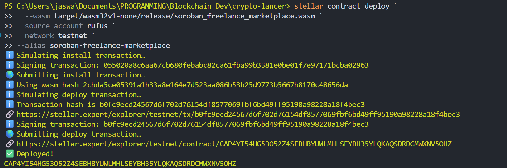

# 🚀 Stellar Freelance Marketplace

A decentralized freelance marketplace built on Stellar using Soroban smart contracts. Employers post tasks, freelancers bid, and funds are held in escrow until delivery.

[](https://opensource.org/licenses/MIT)
[](https://stellar.org/soroban)

## ✨ Features

- **Task Posting** - Employers create tasks with XLM budgets and deadlines
- **Competitive Bidding** - Freelancers submit proposals with custom rates
- **Escrow Protection** - Funds locked in smart contract until work completion
- **Fast Settlement** - Instant payouts using Stellar's speed
- **Low Fees** - Minimal costs with configurable platform fees (default 2.5%)
- **Dispute Resolution** - Built-in arbitration for conflict management

## 🏗️ How It Works

```
1. Employer posts task with budget
2. Freelancers submit bids
3. Employer accepts a bid → funds locked in escrow
4. Freelancer completes work
5. Employer approves → payment released automatically
```

## 🛠️ Tech Stack

- **Smart Contract**: Rust + Soroban SDK
- **Blockchain**: Stellar Network
- **Token**: XLM (Stellar Lumens)

## 🚀 Quick Start

```bash
# Install dependencies
cargo install soroban-cli
rustup target add wasm32-unknown-unknown

# Build
cargo build --target wasm32-unknown-unknown --release

# Deploy
soroban contract deploy \
  --wasm target/wasm32-unknown-unknown/release/soroban_freelance_marketplace.wasm \
  --network testnet
```

## 📋 Core Functions

**For Employers:**

- `post_task()` - Create new task
- `accept_bid()` - Accept freelancer bid (locks funds)
- `approve_work()` - Release payment to freelancer

**For Freelancers:**

- `submit_bid()` - Bid on task
- `start_work()` - Begin working
- `submit_work()` - Submit for review

**Dispute Management:**

- `raise_dispute()` - Either party can raise dispute
- `resolve_dispute()` - Admin resolves with split percentage

## 📸 Deployment



## 🤝 Contributing

Contributions welcome! Feel free to open issues or submit PRs.

## 📄 License

MIT License - see [LICENSE](LICENSE) file for details.

---

**Built on Stellar** ⭐
